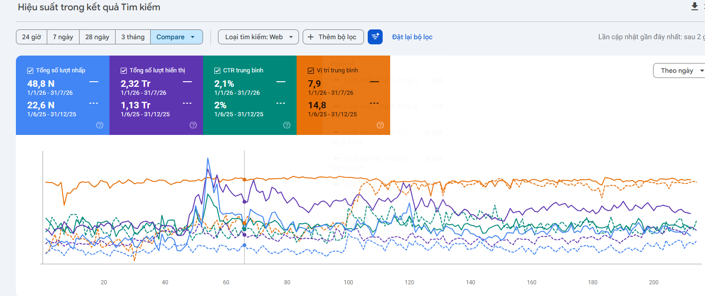

# Technical SEO & Google Search Console Case Study 🔧

A practical technical SEO project focused on improving crawlability, indexation, website structure, and organic search performance monitoring for a travel website serving Inbound and Domestic tourism markets.

> **Confidentiality Note:** Sensitive business information, customer data, account information, and internal company data have been omitted. The performance metrics shown in this case study are limited to aggregated Google Search Console data that can be presented for portfolio purposes.

---

## 📌 Project Overview

| Item | Details |
|---|---|
| Project Type | Technical SEO & Search Performance Optimization |
| Industry | Travel & Tourism |
| Target Markets | Inbound & Domestic |
| Role | Digital Marketing / SEO |
| Platform | WordPress |
| Primary Tools | Google Search Console, Screaming Frog, GA4, Google Tag Manager |
| Main Focus | Crawlability, Indexation, URL Structure, Internal Linking, Technical Health |

---

## 🎯 Project Objective

The objective was to improve the technical foundation of the website so that search engines could efficiently:

- Crawl important pages
- Understand website structure
- Discover relevant content
- Process canonical signals
- Index appropriate URLs
- Re-evaluate optimized pages

The project also established a more systematic workflow for identifying, prioritizing, fixing, and monitoring technical SEO issues.

---

## ⚠️ Technical SEO Challenges

Travel websites can contain a large number of URLs generated from products, categories, content, filters, pagination, and other website functions.

This can create technical SEO challenges such as:

- URLs that should not be indexed
- Duplicate or near-duplicate pages
- Incorrect canonical signals
- Indexation inconsistencies
- Weak internal linking
- Crawl inefficiencies
- Unclear URL structures
- Pages requiring `noindex`
- Sitemap and indexation mismatches

The first step was therefore to understand the website's technical structure before making individual fixes.

---

## 🔍 Technical SEO Audit Process

The audit followed a structured workflow:

```text
Website Crawl
      ↓
Google Search Console Review
      ↓
Indexation Analysis
      ↓
URL & Canonical Review
      ↓
Internal Linking Analysis
      ↓
Technical Issue Classification
      ↓
Prioritization
      ↓
Implementation
      ↓
Validation
      ↓
Monitoring

---

## 📈 SEO Performance Evidence

The Google Search Console comparison below shows the change in organic search performance across the selected comparison periods.



### Key Metrics

| Metric | Previous Period | Comparison Period | Change |
|---|---:|---:|---:|
| Organic clicks | 22.6K | 48.8K | +116% |
| Impressions | 1.13M | 2.32M | +105% |
| Average CTR | 2.0% | 2.1% | +0.1 percentage point |
| Average position | 14.8 | 7.9 | Improved by 6.9 positions |

### Performance Observations

During the selected comparison period:

- Organic clicks increased from **22.6K to 48.8K**.
- Search impressions increased from **1.13M to 2.32M**.
- Average position improved from **14.8 to 7.9**.
- Average CTR remained broadly stable while overall organic search visibility increased.

### Areas Covered During the Period

The SEO and website optimization work covered multiple areas, including:

- Technical SEO
- Keyword research and clustering
- Content optimization
- Internal linking
- On-page SEO
- WordPress website optimization

> **Note:** The metrics above represent the observed change between the selected Google Search Console comparison periods. They are presented as performance evidence and should not be interpreted as attribution of the entire change to a single SEO activity.
